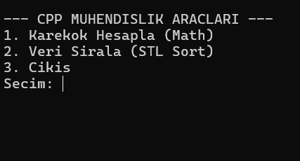

# CPP-Algorithm-Toolkit
# 🛠️ C++ Engineering Toolkit / C++ Mühendislik Araç Seti

[Türkçe açıklamalar için aşağı kaydırın / Scroll down for Turkish]

---

## 🇺🇸 Project Overview
A collection of high-performance algorithms and mathematical tools developed in **C++**. This project focuses on computational efficiency and the use of the **Standard Template Library (STL)** for solving engineering problems.

### 📋 Key Technical Features
- **Numerical Methods:** Implementations of root-finding or linear equation solvers (relevant for engineering assignments).
- **STL Optimization:** Demonstrates efficient use of `std::vector`, `std::sort`, and `std::algorithm` for data manipulation.
- **Sorting & Searching:** Benchmarking different algorithms to show understanding of Big O complexity.
- **Modular Code:** Organized into header (`.h`) and source (`.cpp`) files for professional code structure.

---

## 🇹🇷 Proje Hakkında
**C++** ile geliştirilmiş yüksek performanslı algoritmalar ve matematiksel araçlar koleksiyonudur. Bu proje, hesaplama verimliliğine ve mühendislik problemlerini çözmek için **Standart Şablon Kütüphanesi (STL)** kullanımına odaklanır.

### 📋 Teknik Özellikler
- **Sayısal Yöntemler:** Mühendislik ödevlerinde sıkça kullanılan kök bulma veya lineer denklem çözücü uygulamaları.
- **STL Optimizasyonu:** Veri manipülasyonu için `std::vector`, `std::sort` ve `std::algorithm` kütüphanelerinin verimli kullanımı.
- **Sıralama ve Arama:** Big O karmaşıklığını anlamayı gösteren farklı algoritma performans testleri.
- **Modüler Kod:** Profesyonel kod yapısı için başlık (`.h`) ve kaynak (`.cpp`) dosyalarına ayrılmış organizasyon.

---
## 📸 Preview / Önizleme

*Matematiksel hesaplamalar ve veri sıralama işlemlerinin ekran görüntüsü.*

## 🚀 How to Run / Nasıl Çalıştırılır
1. **Compiler:** C++11 veya üstünü destekleyen bir derleyici gereklidir (G++ gibi).
2. **Compile:** Terminale şu komutu girin:
   `g++ muhendislik.cpp -o muhendislik`
3. **Run:** Programı başlatın:
   `./muhendislik` (Windows için `muhendislik.exe`)
4. **Library:** Bu proje standart kütüphaneleri (`iostream`, `vector`, `algorithm`, `cmath`) kullanır, harici bir kütüphane yüklemenize gerek yoktur.
